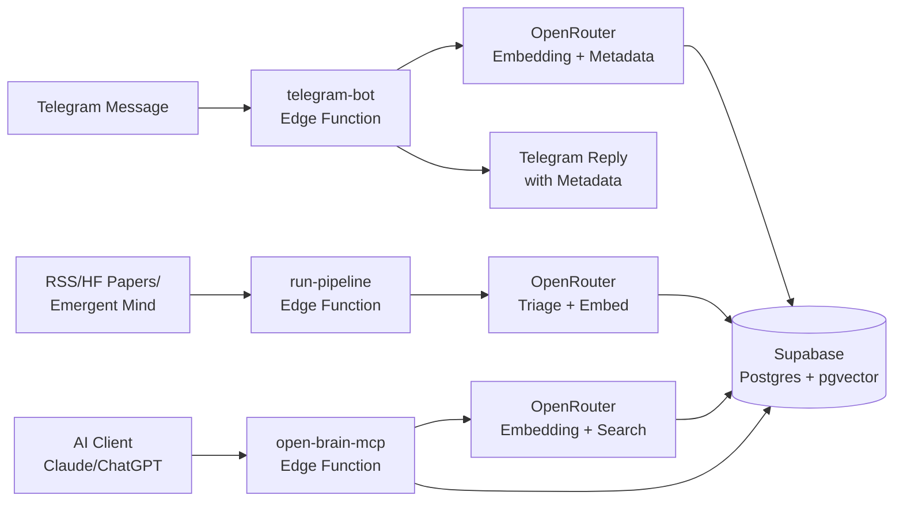

# Open Brain

**Your personal knowledge infrastructure. Capture thoughts from anywhere, search by meaning.**

Open Brain stores your thoughts with AI-generated embeddings so any AI assistant can search your memory by meaning -- not keywords. Thoughts flow in from Telegram, automated pipelines, or any MCP-compatible AI client (Claude, ChatGPT, and others) and are instantly searchable. Everything lives in your own Supabase database, so you own your data.

## How It Works



### Capture Path

When you send a message to the Telegram bot, the **telegram-bot** Edge Function picks it up via webhook. It sends the message to OpenRouter in parallel for two things: generating a vector embedding (a numerical representation of meaning) and extracting metadata like topics, people mentioned, action items, theme, quality score, and named entities. The thought is checked for semantic duplicates, stored in your database with auto-linked connections to related thoughts, and the bot replies with a summary of what it captured.

### Pipeline Path

The **run-pipeline** Edge Function automatically ingests ideas from RSS feeds (AI newsletters), Hugging Face daily papers, and Emergent Mind (trending arXiv papers). Each item is triaged for relevance, embedded, deduplicated, and stored. Runs on a schedule via GitHub Actions.

### Retrieval Path

Any AI client connected via MCP (Model Context Protocol) can search your thoughts by meaning using semantic search, browse by filters (type, topic, person, time), get aggregate statistics, or request a weekly review of themes. The **open-brain-mcp** Edge Function handles these requests, authenticated with your personal access key.

### Storage

Everything lives in Supabase -- a managed Postgres database with pgvector for fast similarity search. There is no infrastructure to maintain. Supabase handles hosting, backups, and scaling. Your thoughts are stored with their embeddings (1536-dimensional vectors), metadata, and timestamps.

## Prerequisites

You will need accounts and tools set up before deploying. Here is what each one does and how to get it:

1. **Supabase account** -- Supabase is a hosted Postgres database with built-in APIs, authentication, and Edge Functions (serverless code). Create a free account at [supabase.com](https://supabase.com). Create a new project -- you will need the **project URL** (looks like `https://abcdef.supabase.co`) and the **service role key** (a long string found under Settings > API).

2. **Supabase CLI** -- The command-line tool for managing your Supabase project (applying database migrations, deploying functions, setting secrets).
   ```
   npm install -g supabase
   ```
3. **OpenRouter account** -- OpenRouter routes requests to AI models. It is used here for generating embeddings (vector representations of your thoughts) and extracting metadata. Create an account at [openrouter.ai](https://openrouter.ai) and generate an API key from the dashboard.

4. **Telegram bot** (recommended) -- The primary way to capture thoughts on the go. Create a bot via [@BotFather](https://t.me/BotFather) on Telegram and run the setup script (see below). If you only want MCP access, you can skip this.

## Quick Start

### 1. Clone the repository

```bash
git clone https://github.com/YOUR_USERNAME/open_brain.git
cd open_brain
```

### 2. Link your Supabase project

```bash
cd openbrain
supabase link --project-ref YOUR_PROJECT_REF
cd ..
```

> **Tip:** Your project ref is the subdomain in your Supabase URL. If your URL is `https://abcdef.supabase.co`, your project ref is `abcdef`.

### 3. Run bootstrap

```bash
./openbrain/scripts/bootstrap.sh
```

Bootstrap walks you through setting up your environment. It prompts for each secret (Supabase URL, service role key, OpenRouter API key, Telegram tokens, etc.), generates a cryptographic MCP access key automatically, and writes everything to `openbrain/.env.local`. If you already have a `.env.local`, it will show your existing values and let you update specific ones.

### 4. Run deploy

```bash
./openbrain/scripts/deploy.sh
```

Deploy applies the database schema (creates the thoughts table with vector search indexes), uploads your secrets to Supabase, and deploys all Edge Functions. It shows a step-by-step checklist as each operation completes. At the end, it prints your MCP connection URL and a ready-to-paste Claude Code command.

### 5. Run validate

```bash
./openbrain/scripts/validate.sh
```

Validate runs 8 checks against your live deployment to confirm everything works: database access, RPC functions, Edge Function reachability, authentication, thought capture, semantic search, and thought listing. It prints a checklist with pass/fail for each check and a final summary.

## Connect Your AI Client

Once deployed, connect your AI client to start using Open Brain. You need two values:

- **MCP endpoint URL:** `https://YOUR_REF.supabase.co/functions/v1/open-brain-mcp/mcp`
- **MCP access key:** The key generated during bootstrap (stored in `openbrain/.env.local` as `MCP_ACCESS_KEY`)

> **Tip:** The deploy script prints the exact connection command with your values filled in. Check the deploy output before copying from below.

### Claude Code (CLI -- recommended)

```bash
claude mcp add --transport http --header "x-brain-key: YOUR_MCP_KEY" open-brain https://YOUR_REF.supabase.co/functions/v1/open-brain-mcp/mcp
```

This registers Open Brain as an MCP server that Claude Code can use in any conversation. Replace `YOUR_MCP_KEY` and `YOUR_REF` with your actual values.

### Claude Code (project .mcp.json)

Add this to a `.mcp.json` file in your project root to share the connection with your team:

```json
{
  "mcpServers": {
    "open-brain": {
      "type": "http",
      "url": "https://YOUR_REF.supabase.co/functions/v1/open-brain-mcp/mcp",
      "headers": {
        "x-brain-key": "${MCP_ACCESS_KEY}"
      }
    }
  }
}
```

> **Note:** The `${MCP_ACCESS_KEY}` syntax uses environment variable expansion so your key stays out of version control. Set the `MCP_ACCESS_KEY` environment variable on each machine that uses this config.

### Claude Desktop

Claude Desktop does not support remote MCP servers via configuration files. Instead:

1. Open **Claude Desktop** > **Settings** > **Connectors**
2. Click **Add a new connector**
3. Enter the MCP endpoint URL: `https://YOUR_REF.supabase.co/functions/v1/open-brain-mcp/mcp`
4. Configure the `x-brain-key` authentication header with your MCP access key

### ChatGPT (Pro/Team/Enterprise/Edu)

1. Go to **Settings** > **Connectors** > **Advanced** > **Developer Mode**
2. Add the MCP server URL: `https://YOUR_REF.supabase.co/functions/v1/open-brain-mcp/mcp`
3. Configure the `x-brain-key` authentication header with your MCP access key

### 6. Set up Telegram bot (optional)

Create a bot via [@BotFather](https://t.me/BotFather) on Telegram, then run the setup script:

```bash
./openbrain/scripts/setup-telegram.sh YOUR_BOT_TOKEN
```

The script verifies your token, registers the webhook, sets up command autocomplete, and prints the env vars and secrets to configure. Follow the printed instructions to complete setup.

## Usage Examples

### Telegram Capture

Send any message to your bot and Open Brain automatically processes it:

```
You: Just had a great meeting with Sarah about the Q3 product roadmap.
     She wants to prioritize the mobile app redesign.

Bot: Captured!
  Type: meeting_note
  Theme: personal
  Topics: q3-roadmap, mobile-app-redesign
  Quality: 0.7
  People: Sarah
  Action items: Prioritize mobile app redesign
  Why: Records a product strategy decision with clear ownership
  Related: "Product planning session notes..." (82% similar)
```

Every message is embedded as a vector, enriched with extracted metadata, checked for duplicates, auto-linked to related thoughts, and entities are resolved into a knowledge graph.

### Semantic Search

Ask any connected AI client to search your brain:

```
You: Search my brain for anything about product roadmap discussions

Claude: I found 3 relevant thoughts:
  1. (0.89 similarity) Meeting with Sarah about Q3 product roadmap...
  2. (0.82 similarity) Product planning session notes...
  3. (0.76 similarity) Quarterly goals discussion...
```

Semantic search finds thoughts by meaning -- even if you used different words. Asking about "product planning" will find thoughts about "roadmap discussions" because the meanings are similar.

### Weekly Review

Get an AI-generated summary of your recent thinking:

```
You: Give me a weekly review of my recent thoughts

Claude: Here's your weekly review:
  Themes: Product planning, team meetings, technical architecture
  Open loops: Mobile redesign decision pending, API migration timeline
  Connections: Sarah mentioned in 3 meetings this week, all about mobile
```

The weekly review analyzes the past 7 days of thoughts and synthesizes themes, open loops, connections between ideas, and gaps in your thinking.

## Available Tools

| Tool | Description |
|------|-------------|
| `search_thoughts` | Semantic search with optional graph expansion (1-hop traversal) |
| `list_thoughts` | Browse thoughts filtered by type, topic, person, theme, quality, time |
| `thought_stats` | Aggregate statistics: counts, type/theme breakdown, top topics/people |
| `capture_thought` | Save a new thought from any AI client (with auto-embedding) |
| `get_connections` | Graph traversal from a thought (typed links: extends, contradicts, etc.) |
| `list_entities` | Browse extracted entities (people, tools, projects, orgs) by frequency |
| `weekly_review` | AI-generated summary of themes, open loops, and next steps |
| `analysis_hubs` | Find high-connectivity thoughts (cluster nuclei) |
| `analysis_density` | Graph health at 4 similarity thresholds |
| `analysis_sources` | Per-source counts and cross-source similarity |
| `dedup_review` | Duplicate candidates with zone histogram |
| `refresh_salience` | Recompute all salience scores |
| `update_thought` | Rewrite content (re-embeds, re-extracts metadata) |
| `delete_thought` | Permanent delete (cascades connections) |
| `migration_guide` | Instructions for importing memories from other platforms |

## Project Structure

```
open_brain/
  openbrain/
    sql/                            # Reference SQL migrations
    supabase/
      migrations/                   # Deployed migrations (supabase db push)
      functions/
        _shared/                    # Shared modules (supabase-client, openrouter, types, errors, auto-link, entities)
        telegram-bot/               # Telegram capture (primary capture path)
          handlers/                 # capture.ts, help.ts
          tests/                    # 14 tests
          index.ts                  # Webhook entry point
        ingest-thought/             # Slack capture (legacy)
        open-brain-mcp/             # MCP server (15 tools)
          tools/                    # Individual tool implementations
        run-pipeline/               # Automated RSS/HF Papers/Emergent Mind ingestion
    scripts/                        # Deployment automation
      bootstrap.sh                  # Interactive setup (.env.local creation)
      deploy.sh                     # Schema + secrets + function deployment
      validate.sh                   # Round-trip deployment verification
      setup-telegram.sh             # Telegram bot setup and webhook registration
  pipeline/                         # Python-based local pipeline (Reddit)
  research/                         # Research and analysis documents
  CLAUDE.md                         # Project instructions for Claude Code
  TRACKER.md                        # Feature status and next directions
  README.md                         # This file
```

## License

MIT
